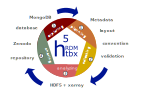

HDF Research Data Management Toolbox
====================================

The "HDF5 Research Data Management Toolbox" (h5RDMtoolbox) is a python package supporting everybody who is working with HDF5
to achieve a sustainable data lifecycle which follows the `FAIR <https://www.nature.com/articles/sdata201618>`_
principles. It specifically supports the five main steps of

 1. Planning (defining a internal layout for HDF5 a metadata convention for attribute usage)
 2. Collecting data (creating HDF5 files or converting to HDF5 files from other sources)
 3. Analyzing and processing data (Plotting, deriving data, ...)
 4. Sharing data (publishing, archiving, ... e.g. to databases like `mongoDB <https://www.mongodb.com/>`_ or repositories
    like `Zenodo <https://zenodo.org>`_
 5. Reusing data (Searching data in databases, local file structures or online repositories
    like `Zenodo <https://zenodo.org>`_.

.. note::

   This project is under current development. A first version is published under version v0.8rc1 (beta version!).
   `Bug and issue reports <https://github.com/matthiasprobst/h5RDMtoolbox/issues/new?title=Issue%20on%20page%20%2Findex.html&body=Your%20issue%20content%20here.>`_
   as well as new ideas are very welcome. Thank you!

.. note::

    The package is tested extensively for python versions `3.8`, `3.9` and `3.10`.

Overview
--------
The packages come with three sub-packages, each covering a different aspect of efficient and sustainable work with
HDF5 files:

  - :doc:`convention <conventions/index>`: Modular construction of conventions (standardization and specification for HDF files)
  - :doc:`wrapper <wrapper/index>`: User-friendly wrapper around `h5py` implementation for efficient work with HDF5 files and above conventions
  - :doc:`database <database/index>`: Querying HDF5 files (A database for HDF5 files or interfacing with mongoDB)

Please navigate through the chapters on the left to learn more about the package. They are organized in the following:

      - :doc:`Getting Started <gettingstarted/index>`: A quick introduction to the package
      - :doc:`Create and process Files <wrapper/index>`: A high-level wrapper for HDF5 files
      - :doc:`Conventions <conventions/index>`: Modular construction of conventions (sets of standardized HDF5 attributes)
      - :doc:`HDF5 Database solutions <database/index>`: A database for HDF5 files
      - :doc:`HowTo <howto/index>`: A collection of FAQs how to do things
      - :doc:`API Reference <api>`: The API reference
      - :doc:`Glossary <glossary/index>`: A glossary of terms used in the package
      - :doc:`References <references>`: A list of references used in the package

Installation
------------
The repository requires python 3.8. or higher (tested for 3.8, 3.9, 3.10).

Install from source from github:

.. code:: sh

   python -m pip install https://github.com/matthiasprobst/h5RDMtoolbox

Clone and install from source:

.. code:: sh

   git clone https://github.com/matthiasprobst/h5RDMtoolbox
   python3.8 -m pip install h5RDMtoolbox/

You may install optional dependencies:

.. code:: sh

   # install dependencies to use the database mongoDB
   python3.8 -m pip install "h5RDMtoolbox[mongodb]"

   # install dependencies for testing
   python3.8 -m pip install "h5RDMtoolbox[test]"

   # install dependencies needed to build this documentation
   python3.8 -m pip install "h5RDMtoolbox[docs]"

   # install all above dependencies
   python3.8 -m pip install "h5RDMtoolbox[complete]"

.. toctree::
   :maxdepth: 3
   :hidden:
   :caption: Documentation

    Getting Started <gettingstarted/index>
    Working with HDF <wrapper/index>
    Conventions <conventions/index>
    Database <database/index>
    HowTo <howto/index>
    FAQ <faq/index>
    API Reference <api>
    Glossary <glossary/index>
    References <references>

.. toctree::
   :maxdepth: 1
   :hidden:
   :caption: Repository

   GitHub Repository <https://github.com/matthiasprobst/h5RDMtoolbox>

