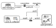

.. _conventions:

Conventions
===========
Conventions establish an interface between the user and HDF5 attributes to introduce standardization helping
to improve the reusability and interoperability of data.

Background/Motivation
---------------------
HDF5 file are very popular due to their hierarchical structure and the possibility to store
large amounts of data and, more importantly, metadata together with data. **However, the management of
the key-value pairs (HDF attributes) are not standardized, and their correctness is left to the user**.

Software and users, who want to reuse the data, have to know the meaning of the attributes and
dependent on the correctness and adherence to a common standard. **The h5rdmtoolbox provides a
mechanism to define and use standardized attributes for HDF5 files**.

Who is it for?
--------------
Dependent on your role within a data project, you may be interested in different aspects of the conventions:

- A **data manager** defines, creates and shares standardized attributes in the form of a convention Start [here]() if you are a data manager.
- A **user** will use the standardized attributes to create or read HDF5 files. Start [here]() if you are a user.

The following sketch illustrates the relevance of a convention in the workflow of using HDF5 files: Data managers define
conventions and share them with the users. The users load and enable the conventions and use them to create HDF5 files.
The convention becomes effective during the creation of the HDF5 file and provides feedback to the user, if the
standardized attributes are not used correctly. Likewise, when the HDF5 file is read, the convention provides feedback
if the attributes are not stored correctly.

What is a convention exactly and how does it work?
--------------------------------------------------
**Definition:** A ``Convention`` is a class which holds a list of ``StandardAttribute`` objects, which are the interface between
the user and a HDF5 attribute. A ``StandardAttribute`` object holds (among others) the following main information:

- **name** of the attribute
- **validator** for the attribute
- **(h5py-)method** to be associated with

**Standard attributes usage:** As HDF5 attributes can be assigned to groups (we will distinguish regular group or root group) and datasets,
a ``StandardAttribute`` as assigned to a (h5py-)method in which the name of the standard attribute becomes
a parameter. Like this, a standardized attribute can be enforced (and validated) during the dataset or group
creation. The possible methods, which standard attributes can be assigned to are:

- ``create_dataset``
- ``create_string_dataset``
- ``create_group`` and
- ``__init__``.

Why adding a ``StandardAttribute`` to a method? The following example illustrates the idea:
Say, we standardize the attribute "units" for a dataset, representing a physical unit.
The user should be able to set the units during the creation. If it is invalid (not understandable by a respective
python package, e.g. ``pint``), the user should be informed and the dataset should not be created:

.. code-block:: python

    >>> import h5rdmtoolbox as h5tbx
    >>> with h5tbx.File("test.h5", "w") as h5:
    >>>     h5.create_dataset("u", data=1, units="m/s")  # works, because valid unit given!
    >>>     h5.create_dataset("v", data=1, units="invalid") # fails, because invalid unit given!
    >>>     h5.create_dataset("w", data=1)  # fails, because no units given!
    >>>     u_units = h5['u'].units  # return the units of the dataset (return type depends on the validator)
    >>> print(u_units.is_compatible_with("km/s")) # it's a pint.Unit object, so e.g. we can check compatibility
    >>> True

So the example shows, how standardized attributes help by writing consistent metadata to HDF5 files. The user
even can profit of the standardized attributes when accessing the data. In the example, the return value of
``h5['u'].units`` is a ``pint.Unit`` object, which can be used to check compatibility with other units, for
instance. More useful examples are outlined in the [practical example section]().

We can make ``StandardAttribute`` objects mandatory or optional. If they are mandatory, the user has to provide
a value for the attribute (see example above). If the user does not provide a value, the creation of the dataset
will fail. If a ``StandardAttribute`` object is optional, the user can provide a value, but it is not required.

Note, a ``Convention`` can be designed and therefore stored in a YAML or JSON file.

The following sections will provide detailed examples on how to use and construct conventions. Depending on your role
within a data project, you may be interested in different aspects of the conventions:
- Usage: Start [here]() if you are a user.
- Creation: Start [here]() if you are a data manager.

.. toctree::
    :maxdepth: 2
    :hidden:

    activate_a_convention.ipynb
    working_with_conventions.ipynb
    creating_a_new_convention.ipynb
    ontologies.ipynb
    Examples <examples/index>