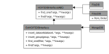

Database
========

After creating one or multiple HDF5 files or received it from someone else, we would like to explore the data. Better said, we want to identify groups or datasets 
based on their attribute values.

HDF5 can be considered a database itself, as it allows multiple datasets and their metadata (attributes) to be stored in a single file. Most of the time, you want to find records in an HDF5 file based on the attributes. However, the `h5py` package does not provide a function to do this.

The *h5rdmtoolbox* provides an interface to perform queries on a single or even multiple HDF5 files.
This is shown in one of the subchapters here. However, this may not always be the fastest way to find data
in an HDF5 file. A more effective way is to map the metadata to a dedicated database. One such example is MongoDB.
The query is performed on the much more efficient dedicated database, then returned to the original file to continue working.

You may implement a new interface between HDF5 and your preferable database solution yourself.
For this, please inherit from the abstract class `h5rdmtoolbox.database.interface.HDF5DBInterface`. The
following class diagram shows the architecture of the database interfaces:

The following two chapters show how the aforementioned approaches (using HDF5 itself and using monogDB) work:

- ``FileDB``: Allows to query inside a single file.
- ``MongoDB``: Using pymongo (mongodb) to mirror metadata of HDF files into the database to be queried afterward.

.. toctree::
    :titlesonly:
    :glob:

    firstSteps.ipynb
    hdfDB.ipynb
    mongo.ipynb